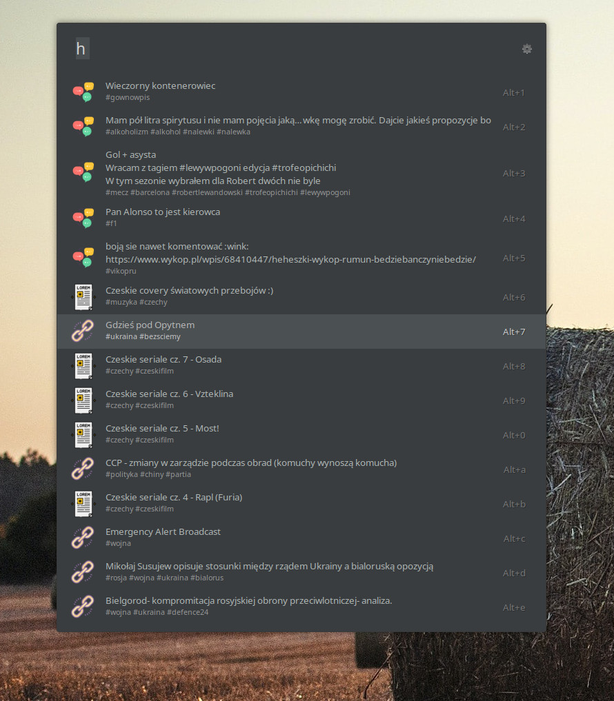

# Hejto (Ulauncher extension)

Plugin for browsing latest news from hejto.pl

## Installation

Install extension by pasting the repository location

```
https://github.com/trojkat/ulauncher-hejto
```


## Usage

Default keyword - `h`


